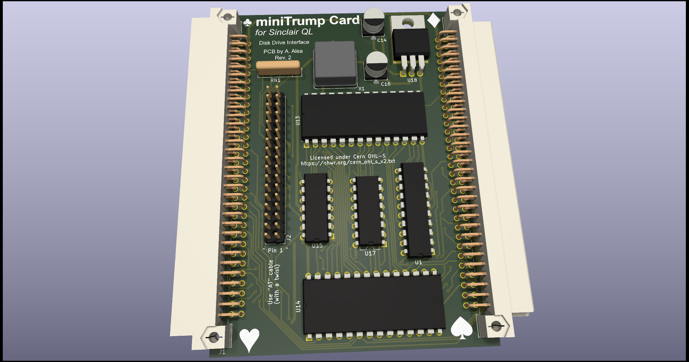
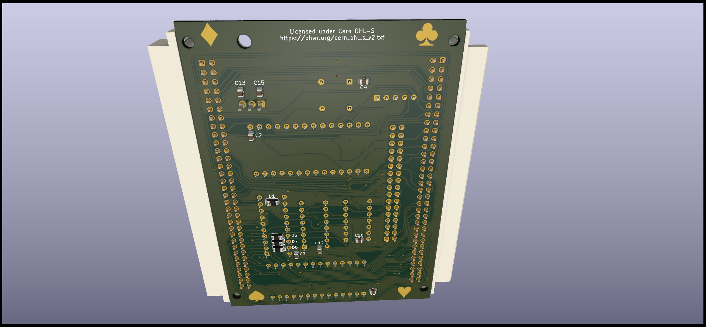

# SINCLAIR QL Mini Trump Card 3 Disk Interface

(C) 2024 Alvaro Alea Fernandez

License under: CERN Open Hardware Licence Version 2 - Strongly Reciprocal

https://ohwr.org/cern_ohl_s_v2.txt

This is a new PCB for the well know Trump Card Interface.

WARNING: This board include a joke (not in the preview picture, surprise!) in the back skillscreen, I'm not political, it's only a game of words, if you do not like, you can remove the back skillscreen when order the PCB or ask me for gerbers without the joke, no problem.

## Advantages

This PCB add a passthrough conector to allow aditional interfaces. (compatibility is limited, not al signal are routed and boards that use the P'N'P mechanism of the QL only work with a Minerva ROM because Sinclair's ROM only search for 1 board)

It's also a lot smaller than original one.

It's use standar AT cable (with a twist) and standar AT disc drives (drives configures as 2nd unit)

## Drawbacks

But it do not have memory, you need a Memory Expansion, be aware that you should use only a 512Kb (total 640Kb) expansion, if you want to have a total of 896Kb (like the original trump card) you should use my expansion board, and connect after the trump card, also JP1 in this board and the equivalent jumper shall be soldered to allow the paging mechanism of the Trump Card.

It only support 2 Disk Drive, no way to use 3 or 4 Drives

For the GAL use the one in the GAL directory, compatible with GAL16V8 and ATF16V8, it's compiled with GALasm that you can found here: https://github.com/daveho/GALasm

# Technical Info

It work with WD1770 and WD1772 floppy disc controlllers.

